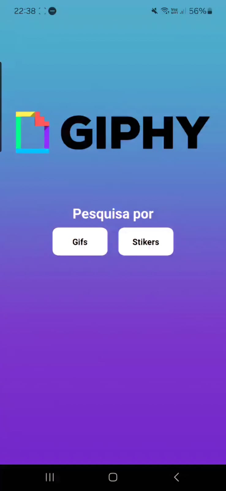

# Buscador de GIFs e Stickers

Este é um projeto simples que permite aos usuários buscar e visualizar GIFs e Stickers através da API do Giphy. 

# A aplicação

# 💻 Técnicas e Tecnologias
- Expo
- Componentes React Native
- Componentes customizados
- Suporte a telas
- Dafont
- StyleSheet
- React-Native
- AsyncStrorage
- React Navigation
- React Native
- Axios

